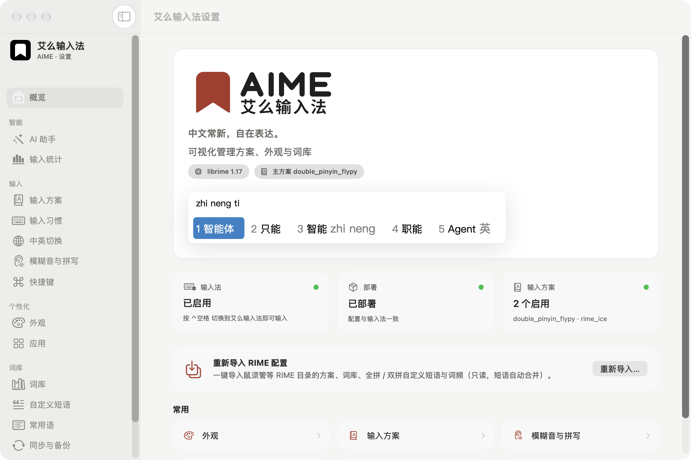
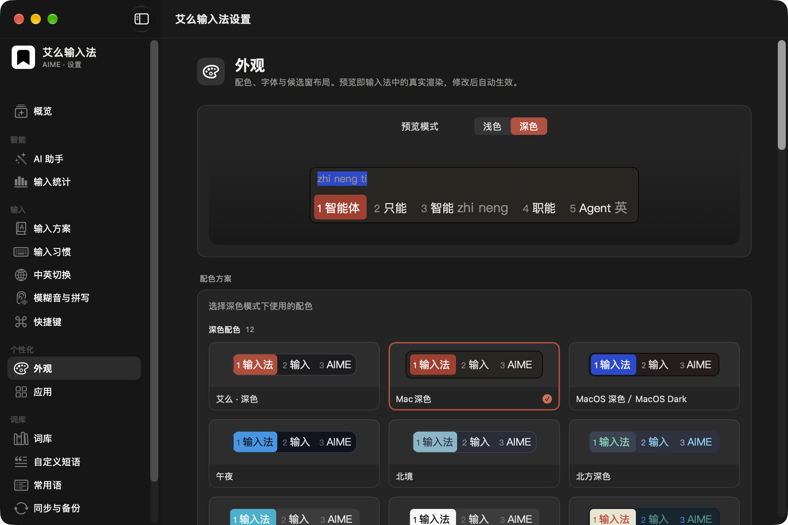
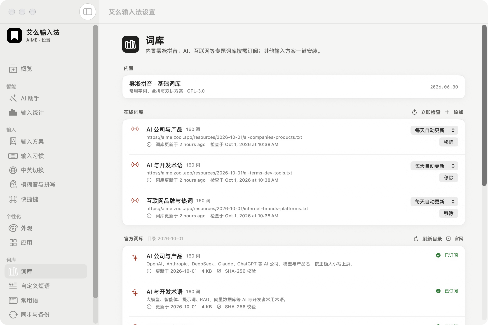
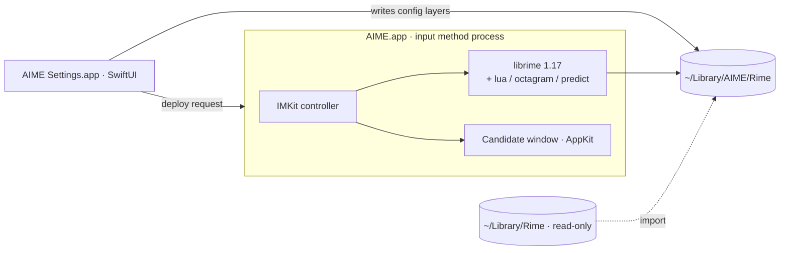

<p align="center">
  <picture>
    <source media="(prefers-color-scheme: dark)" srcset="assets/brand/aime/base-v1/lockup-white.png">
    
  </picture>
</p>

<p align="center"><b>Fresh Chinese, freely expressed.</b></p>

<p align="center">An open-source Chinese input method for macOS, built on RIME · local first · optional AI</p>

<p align="center">
  <a href="https://aime.zool.app/en/">Website</a> ·
  <a href="https://github.com/zoolapp/aime/releases">Download</a> ·
  <a href="https://aime.zool.app/en/docs/">Documentation</a> ·
  <a href="docs/privacy.md">Privacy</a> ·
  <a href="README.md">中文</a>
</p>

<p align="center">
  <a href="https://github.com/zoolapp/aime/actions/workflows/ci.yml"></a>
  <a href="https://github.com/zoolapp/aime/releases"></a>
  <a href="LICENSE"></a>
  
  
  
</p>

<p align="center">
  
</p>

> [!IMPORTANT]
> **Developer preview.** The installer is not yet signed with a Developer ID or notarized; until it is, packages on
> [Releases](https://github.com/zoolapp/aime/releases) are pre-releases — see Install below. AIME is an independent project, not a fork of
> Squirrel, contains none of its GPL source, and can be installed alongside it.

## Why AIME

| | |
|---|---|
| **Open source, built on RIME** | Powered by [librime](https://github.com/rime/librime) with [rime-ice](https://github.com/iDvel/rime-ice) as the default schema. Reads your existing RIME configuration and imports from Squirrel read-only. AIME's own code is MIT-licensed. |
| **Your typing stays on your Mac** | Input is processed locally: no input logs, no collection or upload of what you type, no analytics. Snippets and input statistics never leave the Mac. |
| **AI-powered, on your terms** | Translate, polish, convert Simplified/Traditional or run your own prompts — hold ⌥, press Space, done at the cursor. Defaults to Apple's on-device model and only touches the text you choose. |
| **Smoother typing** | librime runs in-process with a natively drawn candidate window — p50 0.34 ms / p99 0.61 ms per key for rime-ice on a development Mac. Snippet categories, phrase codes, a symbol board picked by letter keys, pinned frequent words. |

## Features

- **Quick menu** — hold ⌥ while typing: Space opens AI actions, digits open snippets, symbols, frequent words and settings; no mouse needed.
- **AI actions** — translate, polish, convert or run custom actions (e.g. Cantonese) on the selection, the text just typed, or the candidate being composed; results appear as candidates and Return replaces the text.
- **Draft layer (optional)** — typed text waits at the cursor until Return, so a whole sentence can be polished before it is sent.
- **Visual settings** — 80+ options covering everyday RIME configuration: candidates, Chinese/English switching, fuzzy pinyin, shortcuts, Traditional output, per-app defaults ([research notes](docs/rime-config-reference.md)).
- **Appearance** — colour scheme gallery with live preview, fonts, horizontal or vertical layout, radii and spacing, custom schemes with contrast warnings.
- **Vocabulary** — an official online catalogue (versioned, SHA-256 verified, daily or weekly updates), any RIME-compatible word list, and one-click schema packages (rime-ice, Wanxiang, rime-frost) with conflict warnings.
- **Snippets and phrases** — categorised snippets (phone, email, address…) and a table editor for custom phrases.
- **Input statistics (optional, local only)** — daily characters, hours and apps, frequent words you can pin.
- **Sync and backup** — merge learned frequencies across Macs through a RIME sync folder; export and restore a local backup file, with no cloud involved.
- **First-run guide** — from enabling the input method to choosing full or double pinyin and trying sample phrases, in about a minute.
- **CLI** — `aime deploy / bench / doctor / import-squirrel / package / get / set / sync` for scripting and CI.

<p align="center">
  
  
</p>

## Install

### Pre-release package

1. Download the latest `AIME-<version>.pkg` from [Releases](https://github.com/zoolapp/aime/releases) and verify it with the `SHA256SUMS.txt` on the same page:

   ```bash
   shasum -a 256 -c SHA256SUMS.txt --ignore-missing
   ```

2. Pre-releases are not notarized: right-click the package and choose Open, or remove the quarantine attribute first with `xattr -dr com.apple.quarantine AIME-<version>.pkg`.
3. Open **System Settings › Keyboard › Input Sources › Edit…**, click **+** and add **AIME** under Chinese, Simplified. If it does not appear after the first install, log out and back in.

### Build from source

Requires macOS 26+, Xcode 26+ and [XcodeGen](https://github.com/yonaskolb/XcodeGen) (`brew install xcodegen`).

```bash
git clone https://github.com/zoolapp/aime.git && cd aime
bash scripts/install-dev.sh
```

The script downloads and verifies pinned librime and rime-ice releases, builds the input method, the settings app and the CLI, installs to `~/Library/Input Methods/AIME.app` and registers it.

## Migrating from Squirrel

1. Run "Sync user data" once in Squirrel so the frequency snapshots are current.
2. In AIME Settings, choose Import on the Overview page, or use the CLI:

   ```bash
   ~/Library/Input\ Methods/AIME.app/Contents/Helpers/aime import-squirrel --dry-run   # preview
   ~/Library/Input\ Methods/AIME.app/Contents/Helpers/aime import-squirrel
   ```

The import is read-only — `~/Library/Rime` is never modified. Your `*.custom.yaml` files are kept as they are in `~/Library/AIME/Rime/aime/imported/`; changes made in the app live in a separate layer that takes precedence and can be reset at any time.

## Architecture



The settings app does not link librime; it reads and writes files and asks the input method to redeploy through distributed notifications. Every setting is composed from three layers: AIME defaults → hand-written patches → changes made in the app. See [Architecture](docs/architecture.md) and the [decision records](docs/decisions/).

## Development

```bash
bash scripts/fetch-librime.sh && bash scripts/fetch-dicts.sh
swift build --package-path Packages/AIMEKit && bash scripts/stage-plugins.sh
swift test --package-path Packages/AIMEKit
xcodegen generate && open AIME.xcodeproj
```

Performance gate: `aime bench --schema rime_ice --keys nihaoshijie --iterations 2000 --assert-p99-ms 5`.
See [CONTRIBUTING.md](CONTRIBUTING.md) for contributing, [docs/releasing.md](docs/releasing.md) for releases, and report security issues privately as described in [SECURITY.md](SECURITY.md).

## Privacy

Input is processed on your Mac; AIME writes no input logs, never uploads pinyin, candidates or learned frequencies, and ships no analytics or crash-reporting SDKs. Subscribed online vocabularies are fetched from their public URLs at the interval you choose.
Text reaches an AI model only when you run an AI action: Apple's on-device model runs locally; a cloud endpoint you configure yourself must be explicitly allowed to receive text. See [Privacy](docs/privacy.md).

## Roadmap

- [x] librime frontend, candidate window, CLI, developer install and CI
- [x] Visual settings, appearance preview, per-app options, snippets and custom phrases
- [x] Official online vocabulary catalogue, schema packages (pinned versions, SHA-256)
- [x] Quick menu, AI actions (on-device / bring your own endpoint), draft layer
- [x] Input statistics, first-run guide, local backup and restore
- [ ] Developer ID signing, notarization and automatic updates
- [ ] Vertical text orientation, candidate paging indicator
- [ ] Reproducible librime builds from source

## Acknowledgements

[RIME / librime](https://github.com/rime/librime) · [Squirrel](https://github.com/rime/squirrel) · [rime-ice](https://github.com/iDvel/rime-ice) · [rime_wanxiang](https://github.com/amzxyz/rime_wanxiang) · [rime-frost](https://github.com/gaboolic/rime-frost) · [rime-essay](https://github.com/rime/rime-essay) · [OpenCC](https://github.com/BYVoid/OpenCC) · [Yams](https://github.com/jpsim/Yams)

## License

AIME's original code is released under the [MIT License](LICENSE). The bundled native `librime-octagram` plugin and the rime-ice schemas, word lists and Lua scripts remain under GPL-3.0;
AIME's online word lists are CC BY 4.0. Other third-party components are listed in [THIRD_PARTY_NOTICES.md](THIRD_PARTY_NOTICES.md), and the native plugin licence review is in [docs/native-plugin-license-audit.md](docs/native-plugin-license-audit.md).
MIT for the original code does not mean the whole installer is MIT-only.

<p align="center"><sub>Published and maintained by <a href="https://zool.app">ZOOL LLC</a> · Developed by Luo Lei (<a href="https://github.com/foru17">@foru17</a>) · AIME and 艾么输入法 are product names of ZOOL LLC</sub></p>
