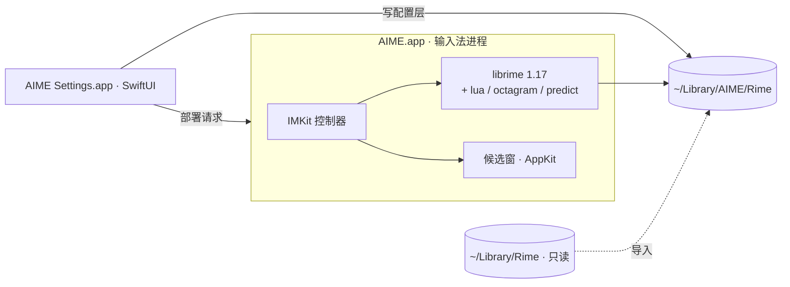

<p align="center">
  <picture>
    <source media="(prefers-color-scheme: dark)" srcset="assets/brand/aime/base-v1/lockup-white.png">
    
  </picture>
</p>

<p align="center"><b>中文常新，自在表达。</b></p>

<p align="center">基于 RIME 的开源 macOS 中文输入法 · 本地优先 · 可选 AI</p>

<p align="center">
  <a href="https://aime.zool.app">官网</a> ·
  <a href="https://github.com/zoolapp/aime/releases">下载</a> ·
  <a href="https://aime.zool.app/docs/">使用文档</a> ·
  <a href="docs/privacy.md">隐私说明</a> ·
  <a href="README.en.md">English</a>
</p>

<p align="center">
  <a href="https://github.com/zoolapp/aime/actions/workflows/ci.yml"></a>
  <a href="https://github.com/zoolapp/aime/releases"></a>
  <a href="LICENSE"></a>
  
  
  
</p>

<p align="center">
  
</p>

> [!IMPORTANT]
> **早期版本（0.1.x）。** 功能仍在快速迭代；正式版安装包已用 Developer ID 签名并通过 Apple 公证，下载前可在 [Releases](https://github.com/zoolapp/aime/releases) 核对版本说明与校验文件。AIME 是独立项目，不是鼠须管（Squirrel）的分支，不包含其 GPL 源码，可与鼠须管同时安装。

## 有些话，适合静静打出来

语音输入很方便。但不想说话的时候、在共享空间里不便开口的时候，或想边写边想、慢慢斟酌一句话的时候，键盘依然有它的位置。

AIME 为这些时刻而做：保留 RIME 的开放与自由，用原生界面管理输入习惯，在需要时加入 AI 辅助。无内置广告，日常输入在本机处理，方案、外观与词库由你选择。

如果你希望保留全拼／双拼和自己的词库，又想少写一些配置文件；如果你重视安静写作、工具透明和表达的掌控感，可以试试 AIME。

## 为什么是 AIME

| | |
|---|---|
| **开源，站在 RIME 肩上** | 以 [librime](https://github.com/rime/librime) 为引擎、[雾凇拼音](https://github.com/iDvel/rime-ice) 为默认方案。可从鼠须管只读导入已有配置，不改动原目录。AIME 原创代码以 MIT 许可开源。 |
| **日常输入在本机处理** | 组字、候选与个人词频都在本机，不写输入日志，不内置广告、遥测或崩溃上报。常用语与可选输入统计只存于本机。 |
| **AI 由你主动调用** | 翻译、润色与自定义动作，长按 ⌥ 再按空格即可在光标处完成；只有你主动执行时才处理那一段文字。可用 Apple 端侧模型（取决于设备与地区），或配置自己的 OpenAI 兼容接口。简繁转换在本机完成。 |
| **输入习惯，由你调整** | 用可视化设置管理方案、配色与快捷键；原生候选窗、常用语分类、短语编码、符号板字母直选，让日常输入少些切换。 |
| **词库常新，生态开放** | 官方词库可按每天／每周自动检查，也可仅手动更新；版本与 SHA-256 校验后使用。可订阅 RIME 兼容词表、安装社区方案，从鼠须管只读导入。感谢上游维护者与贡献者。 |

## 功能

- **快捷菜单**：打字时长按 ⌥，空格进入 AI 处理，1–4 进入常用语、符号、高频词、表情，0 打开设置，全程不离开键盘。
- **表情板**：1906 个离线 emoji，分为表情、人物、自然、美食、旅行、活动、物品、符号、旗帜 9 类。数字切分类、字母直选；Shift+字母或空格连续插入，回车插入并关闭，Esc 返回。
- **AI 处理**：对选中文字、刚打的字或正在选的候选执行翻译、润色，或你自己写提示词的动作（如「粤语」）；简繁转换也在这里，但在本机完成。结果以候选列表呈现，回车替换。
- **输入图层（可选）**：打出的字先停在光标处，回车上屏，便于整段润色后再发送。
- **可视化设置**：候选数量、中英切换、模糊音、简拼纠错、快捷键、简繁输出、按应用默认中英文等 80 余项，覆盖常用 RIME 配置（[调研文档](docs/rime-config-reference.md)）。
- **外观**：配色画廊与实时预览、字体字号、横排 / 竖排、圆角与间距；可基于任一配色自定义，并提示对比度不足。
- **词库**：官方在线词库目录（版本与 SHA-256 校验，每天 / 每周自动更新），任意 RIME 兼容词表订阅；雾凇、万象、白霜等方案一键安装，冲突先提示。
- **词库容量与扩展**：雾凇基础包约 187 万条原始记录（未去重）；官方当前版本每表 160 条是额外专题词，可随版本扩充。可以添加自己的 RIME 词表，单表上限 20 MiB、最多 32 个订阅；更新比较实际内容，等量换词或改权重也会生效。
- **整句选词（可选）**：词库页可下载约 405 MB 的万象离线语言模型，再在输入习惯中启用；默认关闭，评分在本机完成。
- **常用语与短语**：分类管理手机号、邮箱、地址等常用内容；表格编辑自定义短语。
- **输入统计（可选，仅本机）**：每日字数、时段与应用分布、高频词，一键置顶为首选。
- **同步与备份**：基于 RIME 同步目录在多台 Mac 间合并词频（AIME 不运营同步服务器）；一键导出 / 恢复本地备份文件。
- **自动更新**：每天检查一次公开的版本清单，有新版本时提示；下载后校验 SHA-256 与开发者签名，再交给系统安装器。可关闭。
- **首次引导**：从启用输入法、选择全拼 / 双拼到试打示例短语，一步步带你完成。
- **命令行**：`aime deploy / bench / doctor / import-squirrel / package / get / set / sync`，便于脚本化与 CI。

<p align="center">
  
</p>

<p align="center">
  
  
</p>

## 安装

### Homebrew

```bash
brew install --cask zoolapp/tap/aime
```

安装后按下方第 3 步添加输入法。升级用 `brew upgrade --cask aime`。

### 安装包

1. 在 [Releases](https://github.com/zoolapp/aime/releases) 下载最新的 `AIME-<版本>.pkg`，并用同一页面的 `SHA256SUMS.txt` 校验：

   ```bash
   shasum -a 256 -c SHA256SUMS.txt --ignore-missing
   ```

2. 先阅读该版本的签名与公证状态，再按 Release 说明安装。正式版已通过 Apple 公证，标为预览或「公证处理中」的版本不能等同于已公证；遇到系统安全提示时先核对版本说明。
3. 打开 **系统设置 › 键盘 › 输入法 › 编辑…**，点击 **+**，在「简体中文」中添加 **艾么输入法**。首次安装后若未出现，请注销并重新登录。

### 从源码构建

App 支持 Apple 芯片与 Intel 的 Mac；命令行工具 `aime` 目前仅支持 Apple 芯片。

从源码构建需要 macOS 26+、Xcode 26+ 与 [XcodeGen](https://github.com/yonaskolb/XcodeGen)（`brew install xcodegen`）。

```bash
git clone https://github.com/zoolapp/aime.git && cd aime
bash scripts/install-dev.sh
```

脚本会下载并校验固定版本的 librime 与雾凇拼音，构建输入法、设置 App 与命令行工具，安装到 `~/Library/Input Methods/AIME.app` 并注册。

## 从鼠须管迁移

1. 在鼠须管菜单中执行一次「同步用户数据」，使词频快照为最新。
2. 打开艾么输入法设置，在概览页点击「导入」；或使用命令行：

   ```bash
   ~/Library/Input\ Methods/AIME.app/Contents/Helpers/aime import-squirrel --dry-run   # 预览计划
   ~/Library/Input\ Methods/AIME.app/Contents/Helpers/aime import-squirrel
   ```

导入只读，不修改 `~/Library/Rime`。你的 `*.custom.yaml` 原样放入 `~/Library/AIME/Rime/aime/imported/`，界面中的修改写在独立一层并优先生效，可随时恢复。

## 架构



设置 App 不链接 librime，只读写文件，通过分布式通知请求输入法重新部署。每项配置由三层合成：AIME 默认值 → 手写补丁 → 界面修改。详见 [架构说明](docs/architecture.md) 与 [架构决策记录](docs/decisions/)。

## 开发

```bash
bash scripts/fetch-librime.sh && bash scripts/fetch-dicts.sh
swift build --package-path Packages/AIMEKit && bash scripts/stage-plugins.sh
swift test --package-path Packages/AIMEKit
xcodegen generate && open AIME.xcodeproj
```

性能门禁：`aime bench --schema rime_ice --keys nihaoshijie --iterations 2000 --assert-p99-ms 5`。
贡献流程见 [CONTRIBUTING.zh.md](CONTRIBUTING.zh.md)，发布流程见 [docs/releasing.md](docs/releasing.md)，安全问题请按 [SECURITY.md](SECURITY.md) 私下报告。

## 文档与参与

[文档导航](docs/README.md) 汇总使用、配置、开发与分发说明。遇到问题可提交 [Issue](https://github.com/zoolapp/aime/issues)；贡献代码请读 [贡献指南](CONTRIBUTING.zh.md)，公共词表贡献请到 [aime-dicts](https://github.com/zoolapp/aime-dicts)。欢迎分享输入习惯、方案与主题，反馈示例请使用虚构文字，不附带个人词频或完整配置目录。

## 隐私

日常输入在本机处理，不写输入日志，不上传拼音串、候选列表或用户词频，不包含任何统计或崩溃上报 SDK。订阅在线词库时，输入法按你设定的频率请求公开词表；版本检查每天请求一次公开的版本清单（可关闭）。
只有你主动执行 AI 动作时，目标文字才交给所选模型：Apple 端侧模型在本机运行，但取决于设备、系统设置与地区（中国大陆设备或账户目前不可用）；若你自行配置云端接口，需单独允许发送文字，服务方可能计费。详见 [隐私说明](docs/privacy.md)。

## 路线图

- [x] librime 前端、候选窗、命令行、开发安装与 CI
- [x] 可视化设置、外观预览、应用选项、常用语与自定义短语
- [x] 官方在线词库目录、方案包管理（固定版本与 SHA-256）
- [x] 快捷菜单、AI 处理（端侧 / 自备接口）、输入图层
- [x] 输入统计、首次引导、本地备份与恢复
- [x] Developer ID 签名、公证与自动更新
- [ ] 竖排文字方向、候选窗翻页指示
- [ ] librime 源码可复现构建

## 致谢

[RIME / librime](https://github.com/rime/librime) · [鼠须管](https://github.com/rime/squirrel) · [雾凇拼音](https://github.com/iDvel/rime-ice) · [万象拼音](https://github.com/amzxyz/rime_wanxiang) · [白霜拼音](https://github.com/gaboolic/rime-frost) · [rime-essay](https://github.com/rime/rime-essay) · [OpenCC](https://github.com/BYVoid/OpenCC) · [Yams](https://github.com/jpsim/Yams)

## 许可

AIME 原创代码采用 [MIT](LICENSE) 许可。安装包还包含 GPL-3.0 组件：原生插件 `librime-octagram`，以及雾凇拼音方案、词表与 Lua 脚本。
因此**安装包作为整体按 GPL-3.0 条款分发**，原创源码本身仍是 MIT（MIT 与 GPL-3.0 兼容）；每个 Release 都附带对应源码包。
AIME 在线词表采用 CC BY 4.0。其余第三方组件见 [THIRD_PARTY_NOTICES.md](THIRD_PARTY_NOTICES.md)，原生插件许可核对见 [插件许可审计](docs/native-plugin-license-audit.md)。

<p align="center"><sub>由 <a href="https://zool.app">ZOOL LLC</a> 发布与维护 · 开发者 Luo Lei（<a href="https://github.com/foru17">@foru17</a>）· AIME 与艾么输入法为 ZOOL LLC 的产品名称</sub></p>

排障与诊断导出见[排障指南](docs/troubleshooting.md)。
