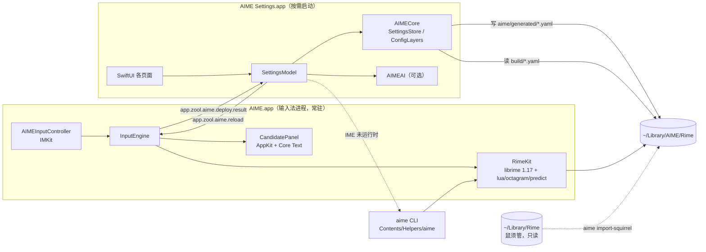

# AIME 架构

> 状态：MVP（v0.1）· 最后更新 2026-09-29

AIME 是 librime 的一个新前端：输入法本体用 InputMethodKit + AppKit 实现，配置管理用 SwiftUI 实现，
两者之间只通过**文件**和**分布式通知**交互。引擎、词库、方案格式与 RIME 生态完全兼容。



## 模块

| 模块 | 位置 | 职责 | 依赖 |
|---|---|---|---|
| CRime | `Packages/AIMEKit/Frameworks/CRime.xcframework` | librime 预编译二进制与头文件（由 `scripts/fetch-librime.sh` 组装，不入库） | — |
| RimeKit | `Packages/AIMEKit/Sources/RimeKit` | librime C API 的类型化 Swift 封装：引擎生命周期、会话、按键映射、配置读取 | CRime |
| AIMECore | `Packages/AIMEKit/Sources/AIMECore` | 配置值模型、三层补丁合成、设置目录、导入器、词库包管理、自定义短语 | Yams |
| AIMEPanel | `Packages/AIMEKit/Sources/AIMEPanel` | 候选窗：主题解析、Core Text 布局与绘制；设置 App 的预览复用同一视图 | AIMECore |
| AIMEAI | `Packages/AIMEKit/Sources/AIMEAI` | 可选 AI 助手：Provider 抽象、自然语言改配置、文本抽词 | AIMECore |
| aime | `Packages/AIMEKit/Sources/aime` | 命令行：deploy / bench / doctor / import-squirrel / package / get / set / sync / register | RimeKit, AIMECore |
| AIME.app | `Apps/AIME` | IMK 输入法服务 | RimeKit, AIMECore, AIMEPanel |
| AIME Settings.app | `Apps/AIMESettings` | 可视化设置（**不链接 librime**） | AIMECore, AIMEPanel, AIMEAI |

## 目录

```
~/Library/Input Methods/AIME.app/Contents/
  MacOS/AIME                      输入法进程
  Helpers/aime                    CLI（不能放 MacOS/：文件系统大小写不敏感，会覆盖 AIME）
  Applications/AIME Settings.app  设置
  Frameworks/librime.1.dylib + rime-plugins/
  SharedSupport/                  只读数据：雾凇拼音、OpenCC、aime.yaml、aime/defaults、aime_tech.txt

~/Library/AIME/Rime/              用户目录（librime user_data_dir）
  default.custom.yaml …           由 AIME 合成的补丁（勿手改）
  aime/imported/*.custom.yaml     手写补丁层（导入的鼠须管配置原样存放于此）
  aime/generated/*.yaml           设置 App 写入的可视化配置层
  aime/packages/*.json            词库包安装清单
  aime/backup/                    安装包时被覆盖文件的备份
  build/                          librime 编译产物
~/Library/Logs/AIME/              librime 日志（默认 WARNING 级别，不记录输入内容）
```

## 关键流程

### 按键

`IMKInputController.handle` → `RimeKey.translate`（keyCode → X11 keysym + 修饰键掩码）→
`process_key` → `get_commit` / `get_context` → `insertText` / `setMarkedText` + 候选窗更新。
全部在主线程同步完成；实测雾凇拼音（含 lua 扩展）单键 **p50 0.34 ms / p99 0.61 ms**（`aime bench`）。

### 配置写入与部署

1. 设置 App 把改动写入 `aime/generated/<name>.yaml`，并重新合成 `<name>.custom.yaml`
   （defaults → imported → generated，后者覆盖前者，见 ADR-0003）。
2. 被修改的目标记入 `aime/.dirty`；部署前删除其 `build/` 产物，规避 librime 秒级时间戳比较。
3. 点击「部署」：若输入法进程在运行，发送 `app.zool.aime.reload`，输入法清理会话 → 重新初始化 →
   部署 `aime.yaml` → `start_maintenance`，完成后回发 `app.zool.aime.deploy.result`；
   否则调用捆绑 CLI `aime deploy`。
4. 高级 YAML 编辑先在临时副本上 `aime deploy --dry-run`，失败自动回滚。

librime 的「工作区更新」只编译 `default.yaml` 和各方案；前端配置 `aime.yaml` 需要前端自己
`deploy_config_file`（鼠须管对 `squirrel.yaml` 也是如此）。另外 librime 在单个方案编译失败时
仍报告整体成功，所以 `aime deploy` 会逐一核对 `schema_list` 中每个方案的产物是否存在。

### 导入鼠须管

`aime import-squirrel`（或设置 App 概览页一键导入）只读 `~/Library/Rime`：复制方案、词库、lua、
OpenCC、语法模型（APFS 克隆，不额外占空间）；`*.custom.yaml` 原样放入 imported 层；
`squirrel.custom.yaml` 映射为前端配置；跳过 `build/`、`*.userdb`（鼠须管正在使用的 LevelDB）、
`installation.yaml`、`user.yaml`；`sync/*/*.userdb.txt` 快照复制进 AIME 的同步目录后执行
`sync_user_data` 合并词频。

## 性能预算

| 指标 | 目标 | 现状 |
|---|---|---|
| 单键处理 p99（process_key + get_context） | ≤ 5 ms | 0.61 ms（雾凇 + lua，M 系列） |
| 候选窗更新 | 单次布局 + 绘制，无 Auto Layout / SwiftUI | `os_signpost` 区间 `panel.update` |
| 首次部署（雾凇全量） | 后台进行，不阻塞打字 | ≈ 11 s |
| 增量部署（改一个设置） | — | ≈ 0.6–2 s |

CI 以 `aime bench --assert-p99-ms 5` 作为性能门禁。
